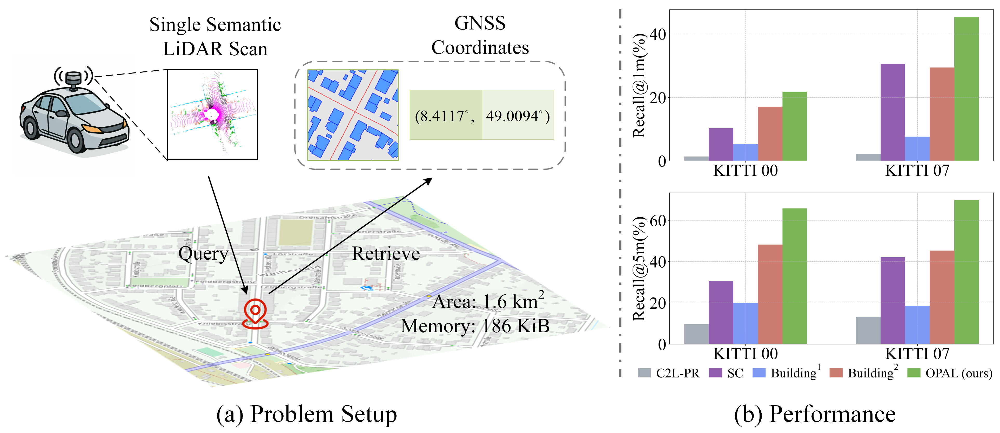

🚨 **Code, pre-trained models, and the accompanying dataset are available at [kang-1-2-3/OPAL](https://github.com/kang-1-2-3/OPAL). This repository is no longer maintained.**

<h2> 
<a href="https://whu-usi3dv.github.io/OPAL/" target="_blank">OPAL: Visibility-aware LiDAR-to-OpenStreetMap Place Recognition via Adaptive Radial Fusion</a>
</h2>

This is the official PyTorch implementation of the following publication:

> **OPAL: Visibility-aware LiDAR-to-OpenStreetMap Place Recognition via Adaptive Radial Fusion**<br/>
> [Shuhao Kang*](https://kang-1-2-3.github.io/), [Martin Y. Liao*](https://martin-liao.github.io/), [Yan Xia](https://yan-xia.github.io/), [Olaf Wysocki](https://olafwysocki.github.io/), [Boris Jutzi](https://www.professoren.tum.de/en/jutzi-boris), [Daniel Cremers](https://cvg.cit.tum.de/members/cremers)<br/>
> *Technical Report*<br/>
> Paper | [**Arxiv**](https://arxiv.org/abs/2504.19258) | Project-page | Video


## 🔭 Introduction
<p align="center">
<strong>TL;DR: OPAL is a learning-based framework for point cloud-to-OpenStreetMap place recognition task.</strong>
</p>


<p align="justify">
<strong>Abstract:</strong>  LiDAR place recognition is a critical capability for autonomous navigation and cross-modal localization in large-scale outdoor environments. Existing approaches predominantly depend on pre-built 3D dense maps or aerial imagery, which impose significant storage overhead and lack real-time adaptability. In this paper, we propose OPAL, a novel network for LiDAR place recognition that leverages OpenStreetMap as a lightweight and up-to-date prior. Our key innovation lies in bridging the domain disparity between sparse LiDAR scans and structured OSM data through two carefully designed components: a cross-modal visibility mask that identifies maximal observable regions from both modalities to guide feature learning, and an adaptive radial fusion module that dynamically consolidates multiscale radial features into discriminative global descriptors. Extensive experiments on the augmented KITTI and KITTI-360 datasets demonstrate OPAL's superiority, achieving 15.98% higher recall at @1m threshold for top-1 retrieved matches while operating at 12x faster inference speeds compared to state-of-the-art approaches. 
</p>

## 🆕 News
- 2025-04-29: We will release the code and complementary datasets upon acceptance of the paper.  


## 💡 Citation
If you find this repo helpful, please give us a 😍 star 😍~. Please consider citing OPAL if this program benefits your project.
```
@misc{kang2025opal,
      title={OPAL: Visibility-aware LiDAR-to-OpenStreetMap Place Recognition via Adaptive Radial Fusion}, 
      author={Shuhao Kang and Martin Y. Liao and Yan Xia and Olaf Wysocki and Boris Jutzi and Daniel Cremers},
      year={2025},
      eprint={2504.19258},
      archivePrefix={arXiv},
      primaryClass={cs.CV},
      url={https://arxiv.org/abs/2504.19258}, 
}
```

## 🔗 Related Projects
We sincerely thank the excellent projects:
- [Scan Context](https://github.com/asdfghjkl623/scancontext) for the P2P place recognition method;
- [OSM-Descriptor-Localization](https://github.com/dudgnsrj/OSM-Descriptor-Localization) for their pioneering P2O place recognition method;
- [C2L-PR](https://github.com/lab-sun/C2L-PR) for the hybrid I2P place recognition framework; 
- [Freereg](https://github.com/WHU-USI3DV/FreeReg) for excellent template; 